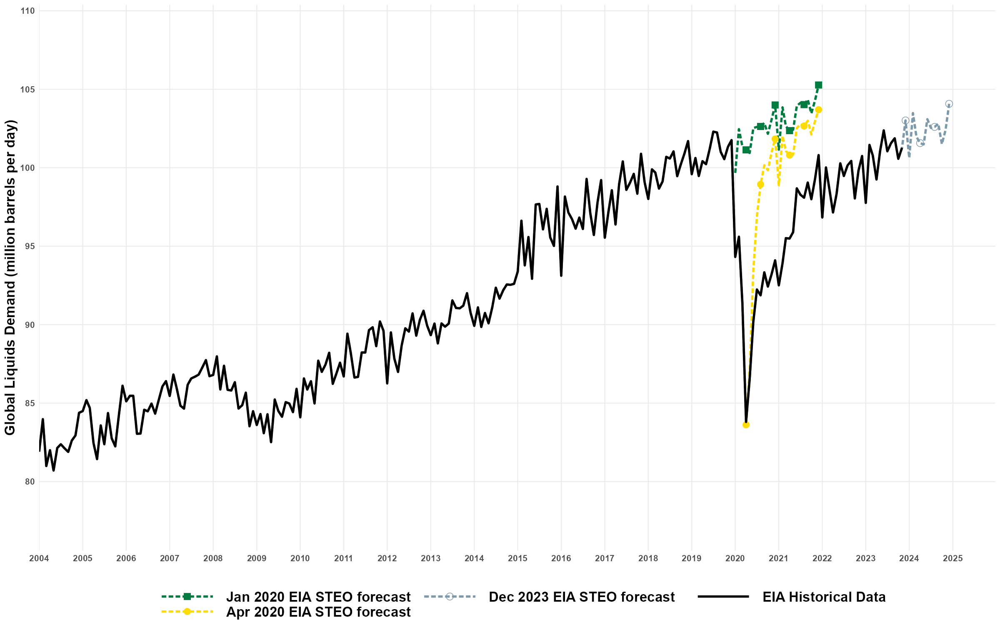

Each month, the [Energy Information Administration (EIA)](https://www.eia.gov/) releases an extensive outlook for energy trade, consumption, production and prices: the [Short Term Energy Outlook (STEO)](https://www.eia.gov/outlooks/steo/).

They have been especially useful during the pandemic, and so this page serves to keep some of these up-to-date and to help me build some analysis.

I used an earlier version of this chart as my entry for the Macleans' Charts to Watch in 2021, and I feel like my suggestion that crude oil demand and prices would be key economic indicators in 2021 has already been vindicated.

